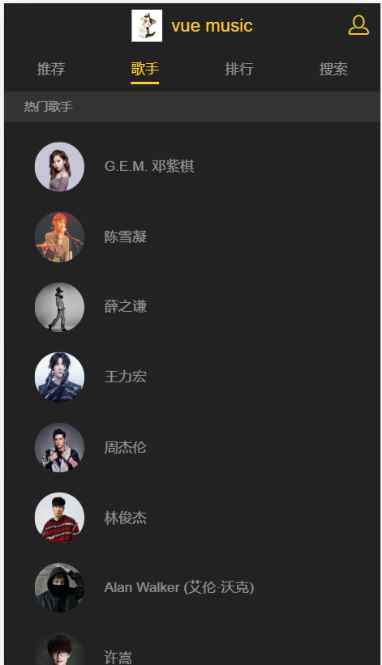
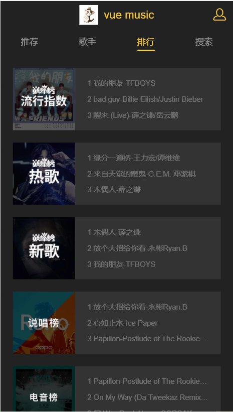
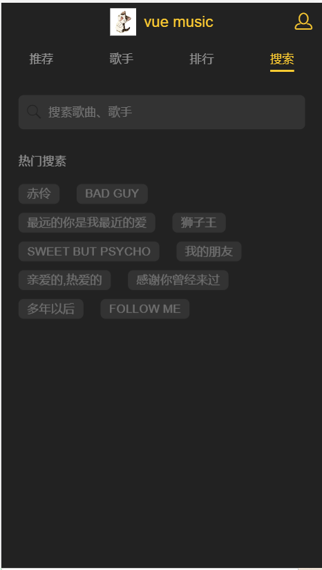
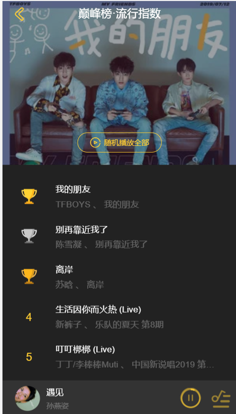
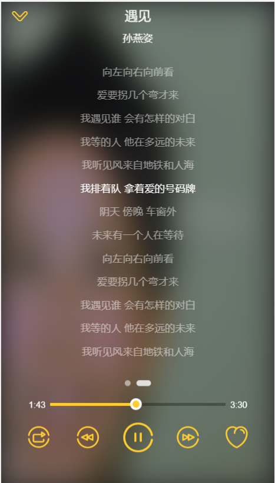

# vue-music

> A Vue.js project

Music interface request at QQ music

## The preview image
### Home page

### singer page

### ranking page 

### search page

### personal center page

### song single list page

### play details page

### lyrics page


## Build Setup

``` bash
# install dependencies
npm install

# serve with hot reload at localhost:8080
npm run dev

# build for production with minification
npm run build

# build for production and view the bundle analyzer report
npm run build --report
```

For a detailed explanation on how things work, check out the [guide](http://vuejs-templates.github.io/webpack/) and [docs for vue-loader](http://vuejs.github.io/vue-loader).
